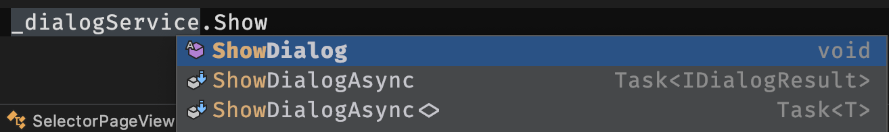

# Dialog Service

The new Prism Dialog Service is designed to provide you a minimalistic framework that you can build on to provide richly styled dialogs that match the look and feel of your app.

|Samples|Selector Dialog|Tap to close
--|--|--
 |  | 

## YouTube Tutorials

Getting Started:
[](http://www.youtube.com/watch?v=swe4XTksiLI "Getting Started with IDialogService")

## Dialog View
Let's start with the view for our dialog.

```xml
<ContentView xmlns="http://xamarin.com/schemas/2014/forms"
    xmlns:x="http://schemas.microsoft.com/winfx/2009/xaml"
    xmlns:prism="http://prismlibrary.com"
    prism:DialogLayout.RelativeWidthRequest="0.75"
    ...>

    <!-- The View -->

</ContentView>
```
## Dialog ViewModel
Dialog view's ViewModel implements `IDialogAware`
```csharp
public class TermsDialogViewModel : BindableBase, IDialogAware
{
    public TermsDialogViewModel()
    {
        Title = "Terms and Conditions";
        SubmitCommand = new DelegateCommand(OnSubmitTapped)
            .ObservesCanExecute(() => CanContinue);
        CancelCommand = new DelegateCommand(OnCancelTapped);
    }

    public DelegateCommand SubmitCommand { get; }
    public DelegateCommand CancelCommand { get; }

    // IDialogAware
    public event Action<IDialogParameters> RequestClose;
    public bool CanCloseDialog() { ... };
    public void OnDialogClosed() { }
    public void OnDialogOpened(IDialogParameters parameters) { }
}
```
## Dialog Registration
Register your dialogs to the container in RegisterTypes() of the App class
```csharp
containerRegistry.RegisterDialog<TermsDialog>();
containerRegistry.RegisterDialog<LockingDialog>();
containerRegistry.RegisterDialog<NameDialog>();
containerRegistry.RegisterDialog<ContactSelectorDialog>();
```
## Usage
```csharp
private readonly IDialogService _dialogService;
public SelectorPageViewModel(IDialogService dialogService)
{
    _dialogService = dialogService;
}
```
Show the dialog,
```csharp
_dialogService.ShowDialog("LockingDialog");
```
Show the dialog and pass in `DialogParameters`,
```csharp
// using Query string
_dialogService.ShowDialog("LockingDialog?Question=Can navigate away?");

// using DialogParameters
_dialogService.ShowDialog("LockingDialog", new DialogParameters
{
    { "Question", "Can navigate away?" }
});
```
Show the dialog and handle callback,
```csharp
_dialogService.ShowDialog("TermsDialog", new DialogParameters(), HandleCallback);

private void HandleCallback(IDialogResult result)
{...}
```
## Extensions
DialogService can be extended to meet the needs. In this sample, the DialogService has a couple of `async` extension methods and a generic extension.

### ShowDialogAsync
This extensions allows showing of the dialog to be awaited.
```csharp
public static Task<IDialogResult> ShowDialogAsync(this IDialogService dialogService,
    string name,
    IDialogParameters parameters)
{
    var tcs = new TaskCompletionSource<IDialogResult>();

    try
    {
        dialogService.ShowDialog(name, parameters, (result) => {
            if (result.Exception != null)
            {
                tcs.SetException(result.Exception);
                return;
            }
            tcs.SetResult(result);
        });
    }
    catch (Exception ex)
    {
        tcs.SetException(ex);
    }
    return tcs.Task;
}
```
usage,
```csharp
var r = await _dialogService.ShowDialogAsync("NameDialog");
return r.Parameters.GetValue<string>("Name");
```

### ShowDialogAsync`<T>`
This extension shows the dialog and expects a parameter with the name matching the `Type` name.
```csharp
public static Task<T> ShowDialogAsync<T>(this IDialogService dialogService,
            string name)
{
    var tcs = new TaskCompletionSource<T>();

    try
    {
        dialogService.ShowDialog(name, (result) =>
        {
            if (result.Exception != null)
            {
                tcs.SetException(result.Exception);
                return;
            }
            tcs.SetResult(result.Parameters.GetValue<T>(typeof(T).Name));
        });
    }
    catch (Exception ex)
    {
        tcs.SetException(ex);
    }
    return tcs.Task;
}
```
usage,
```csharp
var contact = await _dialogService.ShowDialogAsync<Contact>("ContactSelectorDialog");
```
>Note: These extensions are for reference purposes only. Use these techniques to make extensions that fit your needs.