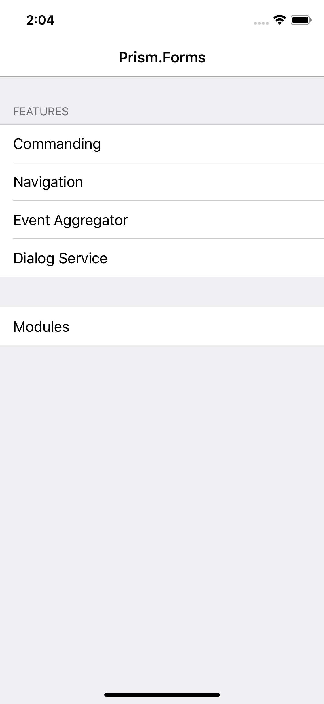
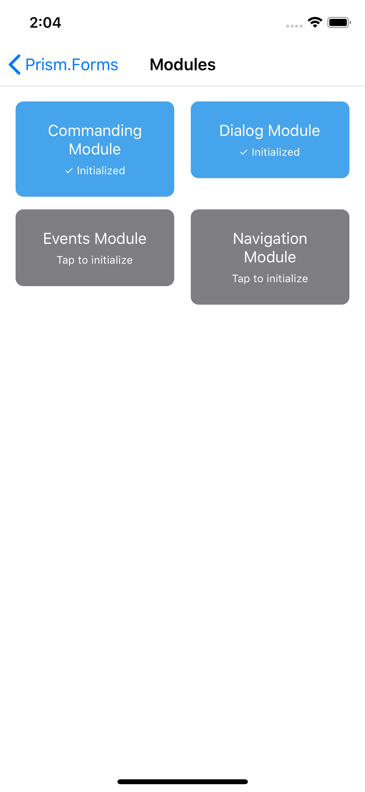

# Prism.Forms Features Gallery
This is a gallery of features offered by Prism and Prism.Forms for Xamarin.Forms apps development. Feel free to use this for your presentations, learning, etc.

| Main Menu | Modules | Navigation with Tabs | Dialog Service |
--|--|--|--
 |  |  | 

## Slides
[XDS Prism Forms](https://github.com/hnabbasi/PrismFormsGallery/blob/master/XDS%20Prism%20Forms.pptx)

These are the slides form the **Xamarin.Forms made better with Prism** talk at [Xamarin Developer Summit 2019](https://xamarindevelopersummit.com/). Feel free to use the parts you need and make it your own.

## Features
- [Commanding](http://prismlibrary.github.io/docs/commanding.html)
- [Navigation](http://prismlibrary.github.io/docs/xamarin-forms/navigation/navigation-basics.html)
- [Event Aggregator](http://prismlibrary.github.io/docs/event-aggregator.html)
- Dialog Service
- Modules
- ...more to come
